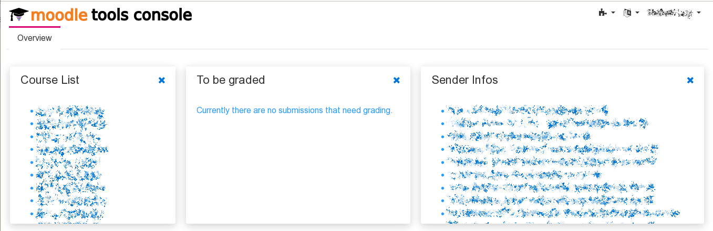

# Moodle Tools Console

This application uses the 
[JGrapes Webconsole](https://mnlipp.github.io/jgrapes/WebConsole.html)
as a basis and adds components to provide a few useful functions 
to Moodle that I found lacking as a teacher.

The application provides three conlets (display elements).

  * The list of courses in which your are enrolled, sorted descending
    by the begin date of the course. This is simply a kind of
    "automatic bookmarks" list. Clicking on an entry opens a new
    browser tab with the course.
    
  * A list of assignments in your courses, where you are a teacher
    and there are submissions to be graded in one of your groups.
    "Your groups" are the groups that belong to a grouping named
    "teacher &lt;last name of teacher&gt;".
    
  * The senders of the latest mails from your inbox. Clicking on 
    an address opens a new tab with all the courses that the sender
    (the student) is enrolled in. From there you can go to the course
    or directly to the student's grading.
